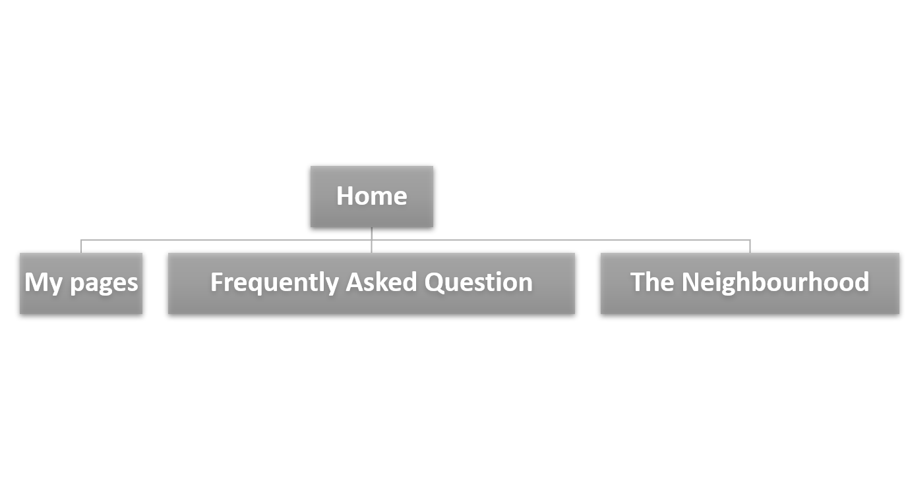
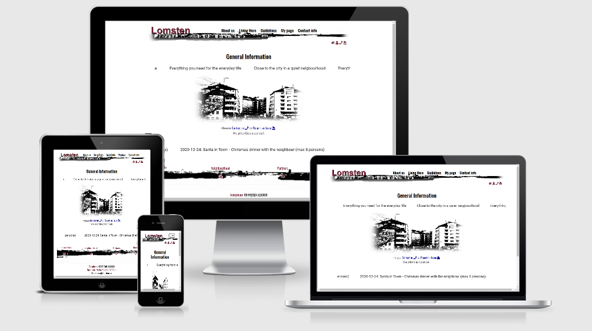

# Lomsten

#### The aim of this website is to in an easy and intuitive way present useful and crucial information to people living or working in a building owned by Lomsten.

---

---

## UX(User Experience)

### Project Goal

#### The goal of this project is to build a website which allows the House owner Lomsten to offer information about their building to their tenants and partners

#### The features on the website will:

- Give Tenants and Partners more ways to interact with Lomsten (contact form, social media, phone, email).
- Provide Tenants and Partners with crucial information about the building and its surrounding (forms, links, modals)

#### I achieved this by:

- Providing contact details and social media links in the footer section of each page.
- Providing an option to the customers to submit their contact and request details in a form under My page
- Providing information about important dates (ticker on index-page), links with information about the living (my pages and question page), links to contact (question page) and useful information about the neighbourhood (neighbourhood page)

### User Goal

#### We expect this website to be used by the following personas

- tenants: these are the people living in the building owned by Lomsten
- the caretaker: this is the people taking care about the building
- the other contractors: these are the people involved in other activities connected to the building

The personas main goal is to find information about building so that they know how they should relate, locate and act within the building. Their age span is supposed to be between 25 and 45 years old.

### User Stories

#### As a tenant I want to have a website so that....

1.  I can find information to who I can contact if I have questions or if need to solve an issue
2.  I can see what is included in the rent
3.  I know where I can find assets such as storage, laundry etc.
4.  I know how I should act in different situations (e.g., when to turn done music, if it is allowed to refurbishing the apartment etc.)
5.  I know if there is something happening that will affect my living
6.  I can find Forms, Blueprint, Invoice, Contract connected to the living so I know how to act in different situations (what is needed to been done when moving in or moving out, when to pay the bill, what is agree upon in the contract etc.)
7.  I can find information about the neighbourhood so I know where to go if I want to shop, eat, park the car etc.

#### As a constructor/contractor I want to have a website so that....

1.  I can find information to who I can contact if I have questions or need to solve an issue
2.  I know where I can find assets such as storage, laundry etc.

### Site Owner Goals

#### As a site owner, I want to create an interactive website allowing the user to easily

1.  Find information about how to relate, locate and act within the building
2.  Find information about how to contact the House owner, contractors and partners
3.  Interact and give feedback about their living
4.  Information of guidelines to save time spent answering these questions orally

---

### Design Choices

#### Typology

#### Fonts

#### I have chosen Oswald in text and in logo in the Header section, Montserrat in the Footer and Roboto plus Oswald in the Main Section and Montserrat in Forms.

#### Colours

#### I focused mainly on black and white colour theme to create a clear, simple and easy to read webpage, the background colour in the footer is #dfe0e4

#### Wireframes

#### The original idea has in dialog with my mentor been revised several of times, below you find the mock-ups created in Balsamiq Wireframes for the original idea, which after implementation was revised to meet a more modern standard
[Large Media Devices](assets/document/MP1en2.pdf "Wireframe Lomsten")
[Small Media Devices](assets/document/MP1ensmd3.pdf "Wireframe Lomsten small devices")

### Before decision to adapt a more modern design the webpage look as the mock-up below

---

## Technologies Used

### Languages

- HTML5
  - Used as the main mark-up language for the website content.
- CSS3
  - Used to style the individual webpages.

### Libraries

- Bootstrap
  - Used to design a mobile-first responsive website layout.
- jQuery
  - Loaded as part of the Bootstrap CDN starter template
- Popper
  - Loaded as part of the Bootstrap CDN starter template
- Prettier
  - Used to format code before deploy the final version of the webpage
- Gitignore
  - Used to format code while constructing the webpage

### Tools

- Git
  - Git was used for version control by utilising the Gitpod terminal to commit to Git and push to GitHub.
- GitHub
  - Used to store, host and deploy the project files and source code after being pushed from Git.
- Gitpod
  - An online IDE linked to the GitHub repository used for the majority of the code development.
- Font-Awesome
  - Used for icons to enhance headings and add emphasis to text.
- Google fonts
  - Used for the website fonts.
- Free CAD
  - Used for creating mock-ups for Blueprint
- Balsamiq Wireframes
  - Used for creating mock-ups for Wireframes
- Microsoft Excel
  - Used for creating mock-ups for e.g., forms as cancelling contract and changing apartment
- Microsoft PowerPoint
  - Used for creating mock-ups for e.g., Topology in readme-file
- Image Resizer
  - Used as first step to optimise image size used on the webpage
- JPEG Compressor
  - Used as a final step to optimise image size used on the webpage
- Am I Responsive?
  - A tool for taking a quick snapshot of the responsive breakpoints of the website to visualise how the site will look on different device screen sizes in one place. The resulting screenshot is also used as the README.md logo image.
- Google Inspection Tool
  - Used for testing the design and its responsiveness
- LightHouse
  - Used for validating how well adjusted the design is in large devices as in small mobile devices
- W3Cs CCS-validator
  - Used for validating the css-code
- W3C Markup-validator
  - Used for validating the html-code

---

## Features

### Features Implemented

- Responsive mobile first design using a Bootstrap framework.
- User friendly with balanced use of image
- Optimised for search engines addressing keywords and description in metatags in Head section
- A Navbar with easy navigation that collapses on mobile displays
- Footer with contact information
- Contact form on My page to allow the user to send their request to the House owner
- Bootstrap accordions to assist with readability of large amounts of text on mobile displays
- Links with useful information to help user find answer on frequently asked questions
- Ticker on home page with information about important dates
- Social media links

### Future Features

- Activate links to social media
- Connected Forms to a SQL-database and make them interactive
- Display PDF such as Blueprint in a modal
- Connect a login-form to My pages and lock this page and make it personalized to individual user

---

## Version Control

### Version control for this repository is managed within GitHub and Gitpod using main as default branch for the project

- To start with a New Repository was created in GitHub, named LittleS
- LittleS was than linked to Gitpod pressing the green button Gitpod in the newly created Repository
- Gitpod was then used as an editor for creating the code in this project
- Python3 -m http.server was used in the Gitpod terminal to see newly made code in the web browser under port 8000
- New or modified files are staged using the git add . command in the Gitpod terminal
- The changes are committed using git commit -m command in the Gitpod terminal.
- The committed changes are pushed from Gitpod to GitHub using the git push command.
- The code was deployed in GitHub selecting main branch under setting in LittleS Repository

---

## Testing

### Testing User Stories from User Experience (UX) Section

- Overall Goals

i. As a visitor it easy to understand main purpose of the site and get an idea on what information that is offered at underlying pages
    
- [When entering the webpage the visitor is presented with a clear, intuitive navbar presenting what is found at underlying pages](assets/document/validation/manual_test_1.png "Manual Test 1")
- [The hero image gives a clear message that this site is handling a housing company](assets/document/validation/manual_test_1.png "Manual Test 1")
- [Below the hero image there is a ticker presenting important dates for the visitor](assets/document/validation/manual_test_1.png "Manual Test 1")
- [Situated under the ticker, links to underlying pages are presented once again, with text, intuitive pictures and titles to further clarify what could be found on underlying pages](assets/document/validation/manual_test_2.png "Manual Test 2")
- [The main purpose of the webpage is further clarified with an About-section and contact information within the Footer section of the main pages](assets/document/validation/manual_test_2.png "Manual Test 2")

ii. As a tenant i can 
   
- [easily get in contact with the company, with contact information being presented in the footer section as well as a form at my pages](assets/document/validation/manual_test_3.png "Manual Test 3")
- [Find answers who to contact in different situation as well as information about the building presented in a clear way on the common questions page](assets/document/validation/manual_test_4.png "Manual Test 4")
- [Find information about the neighbourhood, which is presented in an intuitive way at the neighbourhood page](assets/document/validation/manual_test_5.png "Manual Test 5")
- [Find important documents such as contract, invoice, blueprint at my pages](assets/document/validation/manual_test_6.png "Manual Test 6")
- [Get information on conducts at the common question pages](assets/document/validation/manual_test_7.png "Manual Test 7")
- [Get information what happens in the neighbourhood presented as a ticker on main page](assets/document/validation/manual_test_8.png "Manual Test 8")

iii.  As a constructor/contractor i can 
    
- [easily to find contact information to the company, being presented in a clear way in the footer section](assets/document/validation/manual_test9.png "Manual Test 9")
- [find information about the building under common questions](assets/document/validation/manual_test_10.png "Manual Test 10")

iiii. As a site owner i can

- [easily get information from my user by feedback form on my pages](assets/document/validation/manual_test_11.png "Manual Test 11")
- [easily inform my user by advertising important event on the main page’s ticker](assets/document/validation/manual_test_13.png "Manual Test 13"), [and give valuable information at the common question page](assets/document/validation/manual_test_12.png "Manual Test 12")

### Automated Testing

#### The following validation services and linter were used to check the validity of the website code.
- Chrome DevTools Lighthouse
  - An open-source automated tool for improving webpages by running audits for performance, accessibility, progressive web apps, SEO
- W3C Markup Validation
  - This validator checks the markup validity of Web documents in e.g., HTML
- W3C CSS validation
  - his validator checks the validity of cascading style sheets (css)

#### Below you find results from automated testing

- Result from Chrome DevTools Lighthouse - Large Devices
    - [Index page](assets/document/validation/LightHouse_lg_index_page.png)
    - [profile page](assets/document/validation/LightHouse_lg_profile_page.png)
    - [question page](assets/document/validation/LightHouse_lg_question_page.png)
    - [neighbourhood page](assets/document/validation/LightHouse_smd_neighbourhood_page.png)

- Result from Chrome DevTools Lighthouse - Responsiveness
    - [Index page](assets/document/validation/LightHouse_smd_index_page.png)
    - [profile page](assets/document/validation/LightHouse_smd_profile_page.png)
    - [question page](assets/document/validation/LightHouse_smd_question_page.png)
    - [neighbourhood page](assets/document/validation/LightHouse_lg_neighbourhood_page.png)

- Result from W3C Markup Validation
    - [Index page](assets/document/validation/Html_validation_index_page.png)
    - [profile page](assets/document/validation/Html_validation_profile_page.png)
    - [question page](assets/document/validation/Html_validation_question_page.png)
    - [neighbourhood page](assets/document/validation/Html_validation_neighbourhood_page.png)

- Result from W3C CSS validation
    - [Styles.css](assets/document/validation/CSS_validation.png)

### Manual Testing

#### Following steps were undertaken to test the design and responsiveness of the webpages

1. The webpages was open in Google Chrome
2. The responsivness for all underlying pages was tested by shrinking and enlarging the window of the web browser
3. Links were tested in enlarge mode of the web browser
4. Buttons were tested in enlarge mode of the web browser
5. Accordion were tested in enlarge mode of web browser
6. Tested that links with telephone number opens in default telephone app and that links with email address opens in default email app
7. Tested that contact form at my pages is possible to fill in even though not activated  
8. The code was pushed to GitHub and deployed
9. The deployed code was tested on mobile devices (iPhone, Samsung devices) in accordance with step 3-7
10. As a final step the code was tested in accordance with step 3-6 on Microsoft edge web browser

### Fixed Bugs

#### I have encountered and fixed following bugs

Connected to index.html

- Removed underlines when hovering over links in Header Navbar following comments from José Lopez Coronado and Vahid Alvandi on Stack Overflow adding following code to style.css (see Credit-section)

- Adjusted the dropdown list to be presented to the left of the button using alternatives from bootstrapshuffle adding following code to index.html (see Credit-section)

- Removed Dots in the List in Sub Section Navbar following comments from Alexis on Stack OverFlow adding following code to style.css (See Credit-Section)

- Remove unnecessary code, images and files plus optimised size of images

- Integrated MovingIN and MovingOut checklist as modals (see Credit-section)

- Integrated text content about important dates in index-pages as tickers (see Credit-section)

- Removed unused font-size

- Changed colour theme of background images

- Revised design to be more modern

- Integrated accordions to present text so it doesn’t overflow the pages

- changed contact form from a modal to a contact form on my pages

- Adjusted fontcolor and the opacity of the background-color of navbar to increase the contrast between them

- Defined the height and width of images so they don't change size when enlarging or shrinking the window of the web browser

### Known Bugs

#### Due to shortage of time following bugs are still to be handle

- Eventhough the Hero Image has been resized and optimized it still affect the loadtime of the pages, for optimizing the load time it could be optimal to change image, but for now the image is kept
- The contrast between background image and text-content in contact form could be improved by changing background image
- The contrast between background image and text-content in the header could be improved by changing background image
- The user experience for mobile devices could be increased by making one part of the contract form hidden in mobile devices
- A modal could be implemented for showing the blueprint

---

### Deployment

The website was developed using both Gitpod for constructing code which then was pushed to GitHub, which hosted my repository. I conducted following step to deploy my code.
- Navigated and logged in to GitHub
-  Navigated to my repository [GurraT/LittleS](https://github.com/GurraT/LittleS) 
- Opened settings.
- Scrolled down to the Section GitHub pages
- Selected master branch in the source dropdown menu
- Confirmed choice by clicking on save
#### To see the end result and open deployed code in a web browser following steps were conducted 
- Navigated to my repository [GurraT/LittleS](https://gurrat.github.io/LittleS/) 
- Click on the code bottom
- Selected http-address and copied it to a web browser

---

## Credits

### Content

---

#### Original code

- [a, a:hover,a:visited, a:focus {text-decoration:none;}](https://stackoverflow.com/questions/47482158/bootstrap-4-remove-underline-when-clicked), comments from José Lopez Coronado and Vahid Alvandi on Stack OverFlow

#### Implemented code

- .navbar_header li a:hover{text-decoration:none;}

---

#### Original code

- [dropleft](https://bootstrapshuffle.com/classes) , list with commands for bootstrap on Bootstrapshuffle

#### Implemented code

- div class="dropdown dropleft

---

#### Original code

- [#over{position:absolute; width:100%; height:100%; text-align: center; /_handles the horizontal centering_/}](https://stackoverflow.com/questions/4888223/align-image-in-center-and-middle-within-div) ,comments from Tushar Gupta - curioustushar on Stack OverFlow

#### Implemented code

- .upper_section_left, .lower_section_right{ text-align: center;}

---

#### Original code

- [ul{list-style-type:none;}}](https://stackoverflow.com/questions/36350948/removing-black-dots-from-li-and-ul) ,comments from Alexis on Stack OverFlow

#### Implemented code

- .links_sub_section li a:hover{text-decoration:none;}

---

#### Original code

- [form class="form-inline" action="/action_page.php"](https://www.w3schools.com/bootstrap4/bootstrap_forms.asp) ,example from w3school on Bootstrap Inline Form

#### Implemented code

- form class="form-inline

---

#### Original code

- [text area {resize: none;}"](https://stackoverflow.com/questions/5271782/how-to-disable-the-resize-grabber-of-text area) ,comments from Simon on Stack Overflow

#### Implemented code

- #DescriptionOfIssue {resize: none;}

---

#### Original code

- [input type="radio" id="male" name="gender" value="male"](https://www.w3schools.com/tags/tryit.asp?filename=tryhtml5_input_type_radio) ,example from w3school

#### Implemented code

- input type="radio" id="address" name="address" value="address"

---

#### Original code

- [div class="modal" tabindex="-1" id="signUpModal"](https://github.com/GurraT/Newproject/blob/master/index.html), code example from Code Institute building a Whiskey page

#### Implemented code (in header in forms-pages)

- div class="modal fade" id="MovingIn" tabindex="-1" role="dialog" aria-labelledby="MovingIN" aria-hidden="true"
- div class="modal fade" id="MovingOut" tabindex="-1" role="dialog" aria-labelledby="MovingOut" aria-hidden="true"

---

#### Original code

- [class="tcontainer">
<div class="ticker-move"](https://code-boxx.com/html-css-news-ticker-horizontal-vertical/) , code example on how to make horizontal ticker from code-boxx.com
- [div class="tickerv-wrap"](https://code-boxx.com/html-css-news-ticker-horizontal-vertical/) , code example on how to make vertical ticker from code-boxx.com

#### Implemented code

- div class="tcontainer" div class="mticker-wrap" div class="mticker-move" , implemented for horisontal design of text-content in index.pages
- div class="tcontainer" div class="ticker-wrap" div class="ticker-move",, implemented for vertical design in aboutUs-pages

---

#### Original code

- [div class="accordion"](https://webdevtrick.com/html-css-faq-design/) , example code for jQuery Accordion including both HTML and CSS code with example from webdevtrick.com

#### Implemented code

- e.g. class="nbgh_frame" with included css-code

---

### Media

#### I used images from pexels.com and optimized their size using [Imageresizer](https://imageresizer.com/) as well as [JPEG compressor](https://www.jpegcompressor.org/)

#### I want to thank following persons for enhancing my user experience by using their images

- [Adrien Olichon from Pexels](https://www.pexels.com/photo/architectural-photography-of-brown-building-2387674/) 
- [Daria Shevtsova from Pexels](https://www.bing.com/images/search?view=detailV2&ccid=JmoXW2xN&id=CC6010AF32E5B38CA4482050CF88180EABEE896B&thid=OIP.JmoXW2xNSyDWxp50t50IGwHaE7&mediaurl=https%3a%2f%2fimages.pexels.com%2fphotos%2f1070945%2fpexels-photo-1070945.jpeg%3fcs%3dsrgb%26dl%3dpexels-daria-shevtsova-1070945.jpg%26fm%3djpg&exph=2832&expw=4256&q=pexels-daria-shevtsova-1070945&simid=608017771793744947&ck=19CFC1D5D129453572A851D852441E68&selectedIndex=0&FORM=IRPRST&idpp=overlayview&ajaxhist=0)
- [Emre Can from Pexels](https://www.bing.com/images/search?view=detailV2&ccid=1TNxuUWD&id=CD32453EAFCE4424DC2EDEE3470909EEF4202B9F&thid=OIP.1TNxuUWDZAX8n6Z5pAU0mQAAAA&mediaurl=https%3a%2f%2fwww.hayalmobilya.com%2fwp-content%2fuploads%2f2020%2f03%2fpexels-emre-can-2079249-285x425-1.jpg&exph=425&expw=285&q=pexels-emre-can&simid=607998079420664268&ck=8AB020D04E64DDA7C2F6D56C51F5C77D&selectedIndex=6&FORM=IRPRST&ajaxhist=0)
- [Luca Nardone from Pexels](https://www.bing.com/images/search?view=detailV2&ccid=CHopO%2bbF&id=964BF8E9AC50F5CBD5CBA539DBB5285223112737&thid=OIP.CHopO-bF673tahkJi-RoYgHaE8&mediaurl=https%3a%2f%2ffundscape.co.uk%2fwp-content%2fuploads%2f2020%2f12%2fpexels-luca-nardone-3651820.jpg&exph=400&expw=600&q=pexels-luca-nardone-3651820&simid=608038039845011942&ck=02F6562B64DEAA1BED59724BD30999F2&selectedIndex=1&FORM=IRPRST&ajaxhist=0)
- [Serinus Canaria from Pexels](https://www.bing.com/images/search?view=detailV2&ccid=%2f7DD2BIM&id=177A528DF7091E87011C44D73C0B6FBA099E5F31&thid=OIP._7DD2BIMSJP9Dxj0mPgIxQHaLH&mediaurl=https%3a%2f%2f1.bp.blogspot.com%2f-A7mIl_te89I%2fX7K3vAyLWcI%2fAAAAAAAAI20%2fQR9QvcCPXfQBkO1VL2nybcdsZtrP8LUAwCLcBGAsYHQ%2fs2048%2fpexels-serinuscanaria-5602170.jpg&exph=2048&expw=1365&q=pexels-serinuscanaria&simid=608010217094713036&ck=2B61A9FB4AE7AB5BC8171A6C7BDFE998&selectedIndex=11&FORM=IRPRST&ajaxhist=0)
- [Pixabay from Pexels](https://www.bing.com/images/search?view=detailV2&ccid=C7Rjxer4&id=56FAD0DFD17FE8E761566FCDB222DAFF87BA2308&thid=OIP.C7Rjxer4XadPaD7YcIA77QHaFS&mediaurl=https%3a%2f%2fwww.imske.com%2fwp-content%2fuploads%2f2020%2f10%2fpexels-pixabay-221210-scaled.jpg&exph=1828&expw=2560&q=pexels-pixabay-221210&simid=608047321239849818&ck=157DABB82D043DC579E43E6F62BD9920&selectedIndex=2&FORM=IRPRST&ajaxhist=0)

### Links

- I have extracted information or linked to following pages to provide the personas using my pages with useful information

* [hembygd.se](https://www.hembygd.se/essingeoarna/page/10205)
* [Skatteverket.se](https://skatteverket.se/privat/folkbokforing.4.18e1b10334ebe8bc800039.html)
* [SvenskAddressändring.se](https://www.addressandring.se/)
* [Lagen.nu](https://lagen.nu/)
* [Riksdagen.se](https://www.riksdagen.se/sv/dokument-lagar/dokument/svensk-forfattningssamling/lag-20071150-om-tillsyn-over-hundar-och_sfs-2007-115)
* [Elskling.se](https://www.elskling.se)
* [GasnätetStockholm.se](https://www.gasnatetstockholm.se/gaskund/privatkund/om-jag-inte-valjer-gasleverantor/)
* [Telekomguiden.se](https://www.telekomguiden.se/telefoni/")
* [sl.se](<https://mitt.sl.se/reseplanering/tidtabeller#/TimeTableSearch/GetStationTimeTables/Lilla%20Essingen%20(Buss)%20(Stockholm)/1275/NULL/NULL/35/NULL>)
* [Stockholms parkering](https://parkering.stockholm/)
* [Stockholm Förskola](https://forskola.stockholm/hitta-forskola/forskola/forskolan-luxviken/)
* [Barnstugan-halsingegatan.se](https://www.barnstugan-halsingegatan.se/)
* [Vardcentraler.sll.se](https://vardcentraler.sll.se/hitta-vardcentral/essinge/)
* [BroApoteket](https://sv-se.facebook.com/BroApoteket/)
* [Essinge Tanvård](http://www.essingetdv.se/)
* [Lilla Mamsens Bageri](https://sv-se.facebook.com/Lilla-Mamsens-Bageri-228165660654648/)
* [Dessert och Choklad](https://www.yelp.com/biz/dessert-and-choklad-stockholm-stockholm)
* [Essingen Thai wok och Grill](https://www.facebook.com/pages/Essinge-Thai-Wok-Grill/138040666253647)
* [Pizzeria Ibolina](https://www.facebook.com/Pizzeria-Lilla-Essingen-Ibolina-265390290475856/)
* [Riannas Krog](http://www.rianns.se/)
* [Essinge Tapas](https://essingetapas.se/)
* [LuxDagförDag](http://www.luxdagfordag.se/)
* [Arigato Sushi](https://arigato.se/)
* [Pappas Deli](https://www.pappasdeli.se/)
* [Grazie Trattoria](https://grazie.nu/)
* [ICA](https://www.ica.se/butiker/nara/stockholm/essingen-1223/butikserbjudanden/)
* [Tempo](https://sv-se.facebook.com/tempo.lillaessingen/)
* [Bostads Portalen](https://bostadsportal.se/info/wp-content/uploads/sites/6/2020/11/Hyreskontrakt-fo%CC%88r-fo%CC%88rstahandsuthyrning-BostadsPortal.pdf)
* [Word Mallar](https://www.word-mallar.com/wp-content/uploads/2017/03/Mall-hyresavi.jpg)

### Inspiration

#### The following site has been used for getting inspiration to get a modern feeling on my webpages

[Urban](https://templated.co/urban)

#### The Following README-file was used as an inspiration and extracting information for writing my own README-file
[Aviation-Consultancy](https://github.com/simonjvardy/Aviation-Consultancy)

### Acknowledgements

- I am grateful for the feedback i got from my mentor Narender Singh at Code Institute e.g., to make my webpage more interactive using tickers and modals

#### I also want to thanks following people

- Philip Magnusson who with his insight in the field and with his feedback given me valuable information on how to take the website to the next level
- Carl-Johan Svenlin, Tobias Thomsson, Fredrik Thomsson for beta-testing my webpage and given me constructive feedback on the layout
- The support I got from tutors and student care at Code institute
