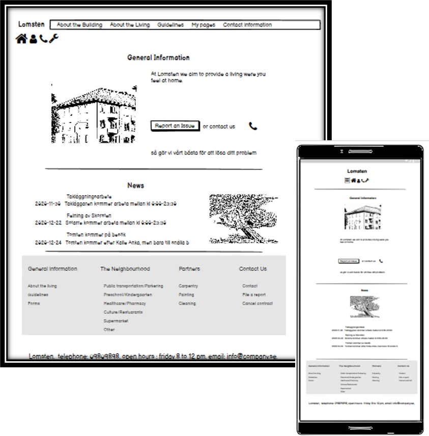

# Lomsten

#### The aim of this website is to in an easy and intuitive way present useful and crucial information to people living or working in a building owned by Lomsten. 

---
---
## UX

### User story
#### We expect this website to be used by the following personas 
- tenants: these are the people living in the building owned by Lomsten
- the caretaker: this is the people taking care about the building
- the other contractors: these are the people involved in other activities connected to the building 

The personas main goal is to find information about building so that they know how they should relate, locate and act within the building. Their agespan is supposted to be between 25 and 45 years old.

### Being more specific 
#### As a tenant I want to have a website so that....
 1.  I can find information to who i can contact if i have questions or if need to solve an issue 
 2. I can see what is included in the rent
 3. I know where I can find assets such as storage, laundary etc.
4. I know how I should act in different situations (eg. when to turn done music, if it is allowed to refurbushing the apartment etc.)
5. I know if there is something happening that will affect my living
6. I can find Forms, Blueprint, Invoice, Contract connected to the living so I know how to act in different situations (what is needed to been done when moving in or moving out, when to pay the bill, what is agree upon in the contract etc.)
7. I can find information about the neighbourhood so I know where to go if I want to shop, eat, park the car etc.

 #### As a constructor/contractor i want to have a website so that....
 1.  I can find information to who i can contact if i have questions or need to solve an issue
 2. I know where I can find assets such as storage, laundary etc.
 

### Decisions

Problems/Opportunities | Importance | Viability/Feasibility|
-----------------------|------------|----------------------|
Create a responsive webpage|5|4
Update text-contents |3|3
Create Forms |4|3
Connect Forms and profile to a database|2|2
Create an online presence | 4|4
Collect feedback from users|4|2
|||
Sum |22 |18

#### Because the sum of Viability/Feasibility and Importance do not add up, decisions on what to implement has to be done
#### For the first prototype following is prioritized

1. The design should be clean, intuitive and responsive
2. Language used in the first version is English (in the final version local language will be used)
3. Forms, Profile-site and interactive part will be presented as Mockups 
4. The final prototype should deployed on GITHUB masterbranch
---
---
### Wireframe 
[Large Media Devices](assets/document/MP1en2.pdf "Wireframe Lomsten")

[Small Media Devices](assets/document/MP1ensmd3.pdf "Wireframe Lomsten small devices")

---
---

## Features

### Prototype
#### The first website should have a clean, simple, intuitive design with functions that are easy-to-use and covers the basal requirements of the users.  The website should first of all be optimized for larger media devices.

Features|   Content |Difficulty level
--------|-----------|----------------|
Framework| Main page, About the building page, Living Here page, Guidelines page, Profile page, Contact Info page, The neighbourhood page, Partner Page, Forms (Report an issue, Login), Linkbuttom to pdf-file (Cancel contract, Contract, Invoice, Blueprint) |2
Simple, clean, intuative design| Header with Logo + link buttom, + nav bar, Section with main text-content, SubSection with links, Footer with contact info| 1
|||
Head | Title and content| 1
Main page: Header|Logo, Buttom-links (Home, Profile, Report an Issue, Contact), Navbar (About the building, About the living, Guidelines, My pages, Contact Information) |1
Main page: Section| Div with General information, Div with News|2
Main page: SubSection | Links to About the living, Guidelines, Forms, Neighbourhood page, Contact Information page, Report an Issue form, Cancel contract form |2
Main page: Footer|Contact information|1
|||
About the Building page: Header|Logo, Buttom-links (Home, Profile, Report an Issue, Contact), Navbar (About the building, About the living, Guidelines, My pages, Contact Information) |1
About the Building page: Section| Div with Vision, Div with History, Div with Board of Management and Executive Committee|2
About the Building page: SubSection | Links to About the living, Guidelines, Forms, Neighbourhood page, Contact Information page, Report an Issue form, Cancel contract form |2
About the Building page: Footer|Contact information|1
|||
Living Here page: Header|Logo, Buttom-links (Home, Profile, Report an Issue, Contact), Navbar (About the building, About the living, Guidelines, My pages, Contact Information) |1
Living Here page: Section| Div with About the Building with list with information on water, electricity, laundary etc..|2
Living Here page: SubSection | Links to About the living, Guidelines, Forms, Neighbourhood page, Contact Information page, Report an Issue form, Cancel contract form |2
Living Here page: Footer|Contact information|1
|||
Guidelines page: Header|Logo, Buttom-links (Home, Profile, Report an Issue, Contact), Navbar (About the building, About the living, Guidelines, My pages, Contact Information) |1
Guidelines page: Section| Div with For your comfort Guidelines, Div with worth to know before implementing|2
Guidelines page: SubSection | Links to About the living, Guidelines, Forms, Neighbourhood page, Contact Information page, Report an Issue form, Cancel contract form |2
Guidelines page: Footer|Contact information|1
|||
Profile page: Header|Logo, Buttom-links (Home, Profile, Report an Issue, Contact, Contract, Invoice, Blueprint, Report an Issue), Navbar (About the building, About the living, Guidelines, My pages, Contact Information) |1
Profile page: Section| Div with News|2
Profile page: SubSection | Links to About the living, Guidelines, Forms, Neighbourhood page, Contact Information page, Report an Issue form, Cancel contract form |2
Profile page: Footer|Contact information|1
|||
Form: LogiN| With Redirection to Profile site|4
|||
Form: Report an Issue | to send in an Issue to a database | 4
|||
Contact Info page: Header|Logo, Buttom-links (Home, Profile, Report an Issue, Contact), Navbar (About the building, About the living, Guidelines, My pages, Contact Information) |1
Contact Info page: Section| Div with Contact Info|2
Contact Info page: SubSection | Links to About the living, Guidelines, Forms, Neighbourhood page, Contact Information page, Report an Issue form, Cancel contract form |2
Contact Info page: Footer|Contact information|1
|||
Form page: Header|Logo, Buttom-links (Home, Profile, Report an Issue, Contact), Navbar (About the building, About the living, Guidelines, My pages, Contact Information) |1
Form page: Section| Div with Contact Info|2
Form page: SubSection | List with links to forms|2
Form page: Footer|Contact information|1
|||
Neighbourhood page: Header|Logo, Buttom-links (Home, Profile, Report an Issue, Contact), Navbar (About the building, About the living, Guidelines, My pages, Contact Information) |1
Neighbourhood page: Section| Div with a list with information about the neighboorhood|2
Neighbourhood page: SubSection | List with links to forms|2
Neighbourhood page: Footer|Contact information|1
|||
Partner page: Header|Logo, Buttom-links (Home, Profile, Report an Issue, Contact), Navbar (About the building, About the living, Guidelines, My pages, Contact Information) |1
Partner page: Section| Div with a contact information to constructor and people involved in the maintance of the building|2
Partner page: SubSection | List with links to forms|2
Partner page: Footer|Contact information|1
|||

### Navigation route for personas 

- To get contact information there is following options to open Contact pages 
1. Click on the Contact buttom in the Header (applicable for all pages)
2. Click on the Contact field in the Navbar (applicable for all pages)
3. Click on the Contact field in the SubSection (applicable for all pages)

- To report an Issue there is following options to open Form to report an Issue
1. Click on the Report an Issue buttom(wrench icon) in the Header (applicable for all pages)
2. Click on the Report an Issue field in the SubSection (applicable for all pages)

- To get information about what is included in the rent and where to find assets such as laundary there is following options to open Living Here pages 
1. Click on the About the living field in the Navbar (applicable for all pages)
2. Click on the About the living field in the SubSection (applicable for all pages)

- To get information about rules and guidelines there is following options to open Guidelines page
1. Click on the Guidelines field in the Navbar (applicable for all pages)
2. Click on the Guidelines field in the SubSection (applicable for all pages)

- To get lastest news connected to the building there is following options 
1. Go to main page eg. through home buttom in Header and in Section there a div with News-content (applicable for all pages)
2. Go to Profile page eg. through login buttom in Header and in Section there a div with News-content (applicable for all pages)

- To download form such as Blueprint, Invoice, Contract there is following options to go to the profile site and click on the download buttom for respectively form
1. Click on the Profile buttom in the Header (applicable for all pages)
2. Click on the My pages field in the Navbar (applicable for all pages)

- To find information about the neighbourhood there is following options to go to the neighbourhood page
1. Click on the Neighbourhood field in the SubSection (applicable for all pages)

### Responsive Design

In order to use this web-page on small media device follow action has/should been done
- Adjust fontsize of logo for small/medium media devices
- Adjust fontsize of Header navbar text for medium media devices
- Remove Header navbar in favor for a buttom in small media devices
- Change size and presentation of Main section div in small and medium media devices
- Adjust fontsize of Sub Section Navbar Title and text-content for small and medium media devices
- Remove Titles for buttoms in Sub Section for small media devices
- Adjust fontsize of Footer text-content for small and medium media devices 
---
### Time plan

#### Part 1. Visual Design and Basal structure

1. Construct a Main page-template readable in small media and large media devices. -Check
2. Test and validate the design through google inspection tool & lighthouse -Check 
3. When satisfied with the design of the Main page use this template to construct the rest of the pages on the website
4. Test and validate the design through google inspection tool & lighthouse
5. Construct a form for login to profile page 
6. Test and validate the form through google inspection tool & lighthouse
5. Construct a form for report an issue -check
7. Test and validate the form through google inspection tool & lighthouse -check
8. Link Contract, Blueprint, Invoice to Mockups
11. Test and validate the whole design through google inspection tool, lighthouse and CCS3/HTML-validator
12. Validate the code via CSS & HTML validator
13. Push code to GITHUB
14. Deploy repository to masterbranch
12. Collect feedback regarding the visual design

#### Part 2. Evaluate webpage

1. Use google ananlytics to see behavoir and traffic on the homepage
2. Adjust the platform from conclusion made
---
---
## Technologies that has been used

#### HTML, CSS, Bootstrap, Font awesome, Google Fonts, Google Inspection Tool, Light House, Image Resizer, 
---
---
## Testing

### Step 1. Implementing code for index.html and style.css
#### Began with implementing code for the index.html, linked it with style.css, Bootstrap, FontAwesome and Google Fonts and tested following Sections

1. Header

    - Logo & Navbar
        * Adjusted fontsize to correlate with rest of the page content
        * Sat color theme by using color picker and choose color from the images used in the page to create harmony between text-color and image color theme
        * Sat padding on Navbar so the links align in a nice way with the Logo
        * Sat fontsize, textcolor (using color picker) and adjusted behavior of hovering function (see fixed bugs) 
        * Adjusted the responsive design by adjusting the fontsize for mediumsized media devices and did  hide navbar for small medium device and instead presented the links in a dropdown-menu
        * Sat border, size and margin for dropdown 
        * Adjusted so the dropdown list was presented to the left of the buttom (see fixed bugs)
    - Link icon
        * Choosed intuitive icons from fontawesome to represent what action to adress
        * Sat textcolor using color picker and fontsize to correlate with the rest of the page
        * Centered icons to the middle of the page
        * Sat fontsize, textcolor (using color picker) and adjusted behavior of hovering function
        * Added a borderline at top & bottom and adjusted the color to rest of the page color theme
        * Sat some padding to adjust the space between the borderlines and icons
        * Adjusted so the dropdown list was presented above the buttom 

2. Main Section
    - Title
        * Sat fontsize, textcolor to correlate with the rest of the page
        * Centered text to the middle of the page

    - Upper Section Container
        * Divided the container in two sized containers 
        * Added an image to the left container and text-contents to the right container
        * Adjusted size of image position of image 
        * Sat textcolor, fontsize and positioning of text-contents to harmonize with the rest of the page
        * Added a Contact Link and a Report Issue link to the text-text contents and adjusted its color
        * Adjusted the responsive design by chancing the size of the container for small & mediumsized media device letting the container with the image be presented above the container with text content for thoose devices
        * Added a bottom-border-line to divide this Upper Section Container with Containers below
        * Adjusted margin and paddings to get some between Header, Title, contents and lower container
    - Lower Section Container ( Same Procedure as Upper Section, with exeption for following points)
        * Added text-contents to left container and image to right container
        * Did not add a border line

3. Sub Section
    * Added a Navbar with four divs with Lists and links connected to a buttom functions  
    * Added Title with intuative icons from font Awesome to respectively buttoms
    * Adjusted fontsize and text-color to harmonize with the rest of the page
    * Removed points in the list (see fixed bugs)
    * Adjusted the responsive design by chancing the size of the container for small & mediumsized media device letting the container with the image be presented above the container with text content for thoose devices
    * Sat border-line above Sub Section
    * Adjusted margin of the Sub Section to get some space between this section and surrounding Sections
    * Added padding to Navbar to get some spacing between navbar and border-lines
    * Adjusted the responsive design by chancing the  font-size title and icons for small & mediumsized media device and removing titles for small media devices

4. Footer
    * Added text-contents and adjusted the fontsize and text-color to harmonize with the rest of the page
    * Adjusted the responsive design by chancing the font-size of textcontents for small & mediumsized media device

### Step 2. Testing Design and Responsiveness of index.html
#### Inorder to test the design of index.html following steps were conducted
######

1. The code from Gitpod was opened on Google Chrome by running following command in the Gitpod terminal "python3 -m http.server"
2. In Google Chrome the design was inspected through enlarging and shrinking the webbrowser window
3. Using Google Inspection tool the responsiveness for mobile devices (eg. Iphone, Samsung Galaxy, Motorola etc..) and computer devices was inspected 
4. The code was added, commit and push to GITHUB using following commands in the Gitpod terminal "git add ., git commit -m "", git push"
5. In GITHUB the code was deployed to "Main Branch" through open setting and navigate to the section "GitHub pages" and under "Source" chosing "Main branch" and confirming the chose pushing "Save"
6. [Deployed webpage](gurrat.github.io/LittleS/index.html) was sent out through Messenger to 5 selected Beta-tester for comments (see Acknowledgement)
7. The deployed webpage was then opened on following browser Microsoft Explorer, Microsoft Edge, Samsung Internet
8. Finally the code was tested using LightHouse in Google Inspection tool (see fixed Bugs and Open Questions)
- Remains to Validate code by using CSS3/HTML-validator and send code to Mentor for comments

### Step 3. Implementing code for ReportAnIssue-form
#### Implementing code for the ReportAnIssue.html, linked it with style.css, Bootstrap, FontAwesome and Google Fonts and tested

#### Form
   - Created main structure for the Form with inputs, select-box, input-text area and submit buttom
   - Adjusted the placement of the items in the Form (see fixed bugs)
   - Adjusted the margin of the items
   - Sat border around items
   - Sat font, fontsize, text-color, and text-alignment of the contents
   - Locked the size of textarea (see fixed bugs)

### Step 4. Testing Design and Responsiveness of ReportAnIssue.html
#### Followed same procedure as Step 2. (Testing Design and Responsiveness of index.html)

* [The deployed code](https://gurrat.github.io/LittleS/ReportAnIssue.html) was sent out to 5 beta-tester for comments (see Acknowledgement) and tested using LightHouse
######

### Step 5. Implementing code for Profilepage.html using index.html as template
#### Following change was done on the template to create profilepage.html
1. Head
    - Changed text-content in Title

2. Header
    - Kept as the template

3. Main Section
    - Added three buttom above first Title-section
    - Removed upper_section div with its content

4. Sub Section
    - Kept as the template

5. Footer
    - Kept as the template

### Step 6. Implementing code for Aboutthebuilding.html using index.html as template
#### Following change was done on the template to create profilepage.html
1. Head
    - Changed text-content in Title

2. Header
    - Kept as the template

3. Main Section
    - Added a Section Dic called board_section in top of this section 
    - Added the text-content "Board of Management and Executive Committee" to board_section
    - Added a table with information of the Boardmember below the text-content mentoined above
    - Changed column-size for the div in the upper-section so image was presented above text-content at all devices types
    - Changed the positioning of image and text middle section depending on device (image right of text-content at large device and above text-content at medium and smaller devices)

4. Sub Section
    - Kept as the template

5. Footer
    - Kept as the template

### Step 7. Testing Design and Responsiveness of Profile.html and Aboutthebuilding.html
#### Followed same procedure as Step 2. (Testing Design and Responsiveness of index.html)

    - Adjusted alignment of Header Icon 
    - Adjusted the margin between text and image contents
    - Set underlines to Title_section
    - Adjusted colortheme
    - Sat meta tags to Header

### Step 8. Run Html-validation on index.html code
#### 

### Step 9. Run Html-revalidation on index.html code
#### 

<!--
1. At early stage lighthouse and google inspections tool will be used, to assure for good and stable design -check
2. After assuring stable visual appealing design the commited code will be deployed through GITHUB masterbranch, -check
the deployed site will be sent out to beta-tester for feedback -check
3. The platform will be update in accordance with feedback from beta-tester -check
4. The updated site would once more be tested via google inspection tool and lighthouse -check
5. When the design is considered to forfill all requirements from above inspection tools, the code will be validated via CSS3/HTML-validation tool !!!
6. After assuring a good and stable code the project will be deployed and sent to mentor for comments !!!
--->
---
### Fixed Bugs
#### I have encountered and fixed following bugs 

Connected to index.html

- Removed underlines when hovering over links in Header Navbar following comments from José Lopez Coronado and Vahid Alvandi on Stack Overflow adding following code to style.css (see Credit-section)
    * .navbar_header li a:hover{text-decoration:none;}

- Adjusted the dropdown list to be presented to the left of the buttom using alternatives from bootstrapshuffle adding following code to index.html (see Credit-section) 
    * div class="dropdown dropleft"

- Centered images in Left_upper_div and Right_lower_div in Main section following comments from Tushar Gupta - curioustushar on Stack OverFlow adding following code to style.css (See Credit-Section)
    * upper_section_left, .lower_section_right{ text-align: center;}

- Removed Dots in the List in Sub Section Navbar following comments from Alexis on Stack OverFlow adding following code to style.css (See Credit-Section)
    * .links_sub_section li a:hover{text-decoration:none;}

- Removed unused classes and junc-code

- Optimized the size of my image using Image resizer (see Credit-section)

Connect to ReportAnIssue.html

- Aligned FirstName and LastName input beside each other using exampel from w3school (see Credit-section) adding following code
    * form class="form-inline"

- Locked the size of the text-area following comments from Simon on Stack Overflow adding following code
    * #DescriptionOfIssue {resize: none;}

### Known Bugs

- Text in right dropdown menu in Footer partially visible
- Image size to large
- Unused CSS and Html code
- Texts and Images could be aligned better

### Open questions
- How should i handle sending, receiving and store info connected to Login, Report an Issue and open inovoices etc
- How do I use Light house and interpret results generated in the reports
- How important is the responsiveness to splash screen
- How important is it that the icon is aplle-touch-compatible
- 

## Deployment

#### The code is made using Gitpod-editor 
#### The code has been pushed to GITHUB using following commands in the Gitpod terminal
* git add .
* git commit -m ""
* git push
#### In GITHUB the code was deployed to "Main Branch" through opening setting and navigate to the section "GitHub pages" and under "Source" chosing "Main branch" and confirming the choice by pushing "Save"-buttom
---
---

## Credits

### Content

---
#### Orginal code 
- [a, a:hover,a:visited, a:focus {text-decoration:none;}](https://stackoverflow.com/questions/47482158/bootstrap-4-remove-underline-when-clicked) , comments from José Lopez Coronado and Vahid Alvandi  on Stack OverFlow
  

#### Implemented code
- .navbar_header li a:hover{text-decoration:none;}

---

#### Orginal code 
- [dropleft](https://bootstrapshuffle.com/classes) , list with commands for bootstrap on Bootstrapshuffle 
#### Implemented code
- div class="dropdown dropleft

--- 
#### Orginal code 
- [#over{position:absolute; width:100%; height:100%; text-align: center; /*handles the horizontal centering*/}](https://stackoverflow.com/questions/4888223/align-image-in-center-and-middle-within-div) ,comments from Tushar Gupta - curioustushar on Stack OverFlow 
#### Implemented code
- .upper_section_left, .lower_section_right{ text-align: center;}

---
#### Orginal code 
- [ul{list-style-type:none;}}](https://stackoverflow.com/questions/36350948/removing-black-dots-from-li-and-ul) ,comments from Alexis on Stack OverFlow 
#### Implemented code
- .links_sub_section li a:hover{text-decoration:none;}

---
#### Orginal code 
- [form class="form-inline" action="/action_page.php"](https://www.w3schools.com/bootstrap4/bootstrap_forms.asp) ,exemple from w3school on Bootstrap Inline Form
#### Implemented code
- form class="form-inline
---
#### Orginal code 
- [textarea {resize: none;}"](https://stackoverflow.com/questions/5271782/how-to-disable-the-resize-grabber-of-textarea) ,comments from Simon on Stack Overflow
#### Implemented code
- #DescriptionOfIssue {resize: none;}
---

### Media
 - Used my own images but optimized their size using [Imageresizer](https://imageresizer.com/) 

### Acknowledgements

- will be added continuously
