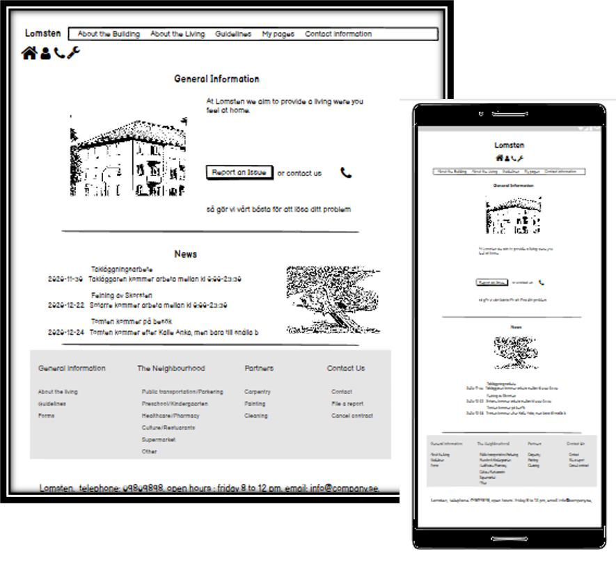

# Lomsten

#### The aim of this website is to in an easy and intuitive way present useful and crucial information to people living or working in a building owned by Lomsten. 

## UX

### User story
#### We aspect this website to be used by the following personas 
- tenants: these are the people living in the building owned by Lomsten
- the caretaker: this is the people taking care about the building
- the other contructors: these are the people involved in other activities connected to the building 

The personas main goal is to find information about building so that they know how they should relate, locate and act within the building. Their agespan is supposted to be between 25 and 45 years old.

#### Being more specific 
- As a tenant I want to have a website so that....
 1.  I can find information to who i can contact if i have questions or if need to solve an issue  
 2. I can see what is included in the rent  
 3. I know where I can find assets such as storage, laundary etc. 
4. I know how I should act in different situations (eg. when to turn done music, if it is allowed to refurbushing the apartment etc.)  
5. I know if there is something happening that will affect my living 
6. I can find Forms, Blueprint, Invoice, Contract connected to the living so I know how to act in different situations (what is needed to been done when moving in or moving out, when to pay the bill, what is agree upon in the contract etc.)  
7. I can find information about the neighbourhood so I know where to go if I want to shop, eat, park the car etc.

 - As a constructor our as another constructor i want to have a website so that....
 1.  I can find information to who i can contact if i have questions or need to solve an issue  
 2. I know where I can find assets such as storage, laundary etc. 
 

#### Decisions

Problems/Opportunities | Importance | Viability/Feasibility|
-----------------------|------------|----------------------|
Create a responsive webpage|5|4
Update text-contents |3|3
Create Forms |4|3
Connect Forms and profile to a database|2|2
Create an online presence | 4|4
Collect feedback from users|4|2
|||
Sum |22 |18

#### Because the sum of Viability/Feasibility and Importance do not add up, decisions on what to implement has to be done
#### For the first prototype following is prioritized

1. The design should be clean, intuitive and responsive
2. Language used in the first version is English (in the final version local language will be used)
3. Forms, Profile-site and interactive part will be presented as Mockups 
4. The final prototype should deployed on GITHUB masterbranch

### Wireframe 
[Large Media Devices](assets/documents/MP1en.pdf "Wireframe Lomsten")

[Small Media Devices](assets/documents/MP1ensmd.pdf "Wireframe Lomsten small devices")

## Features

### Prototype
#### The first website should have a clean, simple, intuitive design with functions that are easy-to-use and covers the basal requirements of the users.  The website should first of all be optimized for larger media devices.

Features|   Content |Difficulty level
--------|-----------|----------------|
Framework| Main page, About the building page, About the living page, Guidelines page, Profile page, Contact Info page, The neighbourhood page, Partner Page, Forms (Report an issue, Login), Linkbuttom to pdf-file (Cancel contract, Contract, Invoice, Blueprint) |2
Simple, clean, intuative design| Header with Logo + link buttom, + nav bar, Section with main text-content, SubSection with links, Footer with contact info| 1
|||
Head | Title and content| 1
Main page: Header|Logo, Buttom-links (Home, Profile, Report an Issue, Contact), Navbar (About the building, About the living, Guidelines, My pages, Contact Information) |1
Main page: Section| Div with General information, Div with News|2
Main page: SubSection | Links to About the living, Guidelines, Forms, Neighbourhood page, Contact Information page, Report an Issue form, Cancel contract form |2
Main page: Footer|Contact information|1
|||
About the Building page: Header|Logo, Buttom-links (Home, Profile, Report an Issue, Contact), Navbar (About the building, About the living, Guidelines, My pages, Contact Information) |1
About the Building page: Section| Div with Vision, Div with History, Div with Board of Management and Executive Committee|2
About the Building page: SubSection | Links to About the living, Guidelines, Forms, Neighbourhood page, Contact Information page, Report an Issue form, Cancel contract form |2
About the Building page: Footer|Contact information|1
|||
About the living page: Header|Logo, Buttom-links (Home, Profile, Report an Issue, Contact), Navbar (About the building, About the living, Guidelines, My pages, Contact Information) |1
About the living page: Section| Div with About the Building with list with information on water, electricity, laundary etc..|2
About the living page: SubSection | Links to About the living, Guidelines, Forms, Neighbourhood page, Contact Information page, Report an Issue form, Cancel contract form |2
About the living page: Footer|Contact information|1
|||
Guidelines page: Header|Logo, Buttom-links (Home, Profile, Report an Issue, Contact), Navbar (About the building, About the living, Guidelines, My pages, Contact Information) |1
Guidelines page: Section| Div with For your comfort Guidelines, Div with worth to know before implementing|2
Guidelines page: SubSection | Links to About the living, Guidelines, Forms, Neighbourhood page, Contact Information page, Report an Issue form, Cancel contract form |2
Guidelines page: Footer|Contact information|1
|||
Profile page: Header|Logo, Buttom-links (Home, Profile, Report an Issue, Contact, Contract, Invoice, Blueprint, Report an Issue), Navbar (About the building, About the living, Guidelines, My pages, Contact Information) |1
Profile page: Section| Div with News|2
Profile page: SubSection | Links to About the living, Guidelines, Forms, Neighbourhood page, Contact Information page, Report an Issue form, Cancel contract form |2
Profile page: Footer|Contact information|1
|||
Form: LogiN| With Redirection to Profile site|4
|||
Form: Report an Issue | to send in an Issue to a database | 4
|||
Contact Info page: Header|Logo, Buttom-links (Home, Profile, Report an Issue, Contact), Navbar (About the building, About the living, Guidelines, My pages, Contact Information) |1
Contact Info page: Section| Div with Contact Info|2
Contact Info page: SubSection | Links to About the living, Guidelines, Forms, Neighbourhood page, Contact Information page, Report an Issue form, Cancel contract form |2
Contact Info page: Footer|Contact information|1
|||
Form page: Header|Logo, Buttom-links (Home, Profile, Report an Issue, Contact), Navbar (About the building, About the living, Guidelines, My pages, Contact Information) |1
Form page: Section| Div with Contact Info|2
Form page: SubSection | List with links to forms|2
Form page: Footer|Contact information|1
|||
Neighbourhood page: Header|Logo, Buttom-links (Home, Profile, Report an Issue, Contact), Navbar (About the building, About the living, Guidelines, My pages, Contact Information) |1
Neighbourhood page: Section| Div with a list with information about the neighboorhood|2
Neighbourhood page: SubSection | List with links to forms|2
Neighbourhood page: Footer|Contact information|1
|||
Partner page: Header|Logo, Buttom-links (Home, Profile, Report an Issue, Contact), Navbar (About the building, About the living, Guidelines, My pages, Contact Information) |1
Partner page: Section| Div with a contact information to constructor and people involved in the maintance of the building|2
Partner page: SubSection | List with links to forms|2
Partner page: Footer|Contact information|1
|||

### Navigation route for personas 

- To get contact information there is following options to open Contact pages 
1. Click on the Contact buttom in the Header (applicable for all pages)
2. Click on the Contact field in the Navbar (applicable for all pages)
3. Click on the Contact field in the SubSection (applicable for all pages)

- To report an Issue there is following options to open Form to report an Issue
1. Click on the Report an Issue buttom(wrench icon) in the Header (applicable for all pages)
2. Click on the Report an Issue field in the SubSection (applicable for all pages)

- To get information about what is included in the rent and where to find assets such as laundary there is following options to open About the Living pages 
1. Click on the About the living field in the Navbar (applicable for all pages)
2. Click on the About the living field in the SubSection (applicable for all pages)

- To get information about rules and guidelines there is following options to open Guidelines page
1. Click on the Guidelines field in the Navbar (applicable for all pages)
2. Click on the Guidelines field in the SubSection (applicable for all pages)

- To get lastest news connected to the building there is following options 
1. Go to main page eg. through home buttom in Header and in Section there a div with News-content (applicable for all pages)
2. Go to Profile page eg. through login buttom in Header and in Section there a div with News-content (applicable for all pages)

- To download form such as Blueprint, Invoice, Contract there is following options to go to the profile site and click on the download buttom for respectively form
1. Click on the Profile buttom in the Header (applicable for all pages)
2. Click on the My pages field in the Navbar (applicable for all pages)

- To find information about the neighbourhood there is following options to go to the neighbourhood page
1. Click on the Neighbourhood field in the SubSection (applicable for all pages)

### Time plan

#### Part 1. Visual Design and Basal structure

1. Construct a Main page-template readable in small media and large media devices.
2. Test and validate the design through google inspection tool & lighthouse
3. When satisfied with the design of the Main page use this template to construct the rest of the pages on the website
4. Test and validate the design through google inspection tool & lighthouse
5. Construct a form for login to profile page
6. Test and validate the form through google inspection tool & lighthouse
5. Construct a form for report an issue
7. Test and validate the form through google inspection tool & lighthouse
8. Link Contract, Blueprint, Invoice to Mockups
11. Test and validate the whole design through google inspection tool, lighthouse and CCS3/HTML-validator
12. Validate the code via CSS & HTML validator
13. Push code to GITHUB
14. Deploy repository to masterbranch
12. Collect feedback regarding the visual design

#### Part 2. Evaluate app

1. Use google ananlytics to see behavoir and traffic on the homepage
2. Adjust the platform from conclusion made

### Open questions
- How should i handle sending, receiving and store info connected to Login, Report an Issue and open inovoices etc

## Technologies that will be used

#### HTML, CSS, Bootstrap, fontawesome, Google analytics

## Testing

1. At early stage lighthouse and google inspections tool will be used, to assure for good and stable design
2. After assuring stable visual appealing design the commited code will be deployed through GITHUB masterbranch,
the deployed site will be sent out to beta-tester for feedback
3. The platform will be update in accordance with feedback from beta-tester
4. The updated site would once more be tested via google inspection tool and lighthouse
5. When the design is considered to forfill all requirements from above inspection tools, the code will be validated via CSS3/HTML-validation tool
6. After assuring a good and stable code the project will be deployed and sent to mentor for comments

## Deployment

#### The code is made using Gitpod-editor 
#### The code will be pushed to GITHUB through using
- git add, git commit and git push commands
#### In GITHUB repository the code will be deployed to a masterbransch

## Credits

### Content
- will be added continuously

### Media
- - will be added continuously

### Acknowledgements

- will be added continuously
