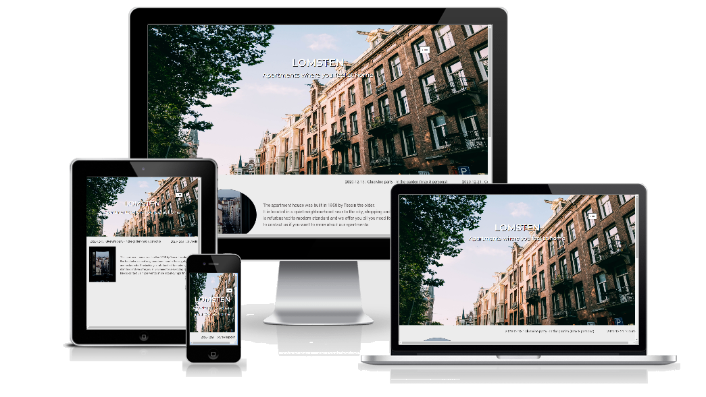

# Lomsten

#### The aim of this website is to in an easy and intuitive way present useful and crucial information to people living or working in a building owned by Lomsten. 

---
---

## Contents ##

-----
## UX(User Experience) ##

### Project Goal ###
#### The goal of this project is to build a website which allows the House owner Lomsten to offer information about their building to their tenants and partners

#### The features on the website will:
* Give Tenants and Partners more ways to interact with Lomsten (contact form, social media, phone, email).
* Provide Tenants and Partners with crucial information about the building and its sourrounding (forms, links, modals)

#### I achieved this by:
* Providing contact details and social media links in the footer section of each page.
* Providing an option to the customers to submit their contact and request details in a form under My page
* Providing information about important dates (ticker on index-page), links with information about the living (my pages and question page), links to contact (question page) and useful information about the neighbourhood (neighbourhood page)

### User Goal ###
#### We expect this website to be used by the following personas 
- tenants: these are the people living in the building owned by Lomsten
- the caretaker: this is the people taking care about the building
- the other contractors: these are the people involved in other activities connected to the building 

The personas main goal is to find information about building so that they know how they should relate, locate and act within the building. Their age span is supposed to be between 25 and 45 years old.

### User Stories ###
#### As a tenant I want to have a website so that....
 1.  I can find information to who i can contact if i have questions or if need to solve an issue 
 2. I can see what is included in the rent
 3. I know where I can find assets such as storage,  laundry  etc.
4. I know how I should act in different situations (e.g., when to turn done music, if it is allowed to refurbishing the apartment etc.)
5. I know if there is something happening that will affect my living
6. I can find Forms, Blueprint, Invoice, Contract connected to the living so I know how to act in different situations (what is needed to been done when moving in or moving out, when to pay the bill, what is agree upon in the contract etc.)
7. I can find information about the neighbourhood so I know where to go if I want to shop, eat, park the car etc.

 #### As a constructor/contractor I want to have a website so that....
 1. I can find information to who I can contact if I have questions or need to solve an issue
 2. I know where I can find assets such as storage, laundry etc.
 
### Site Owner Goals ###
#### As a site owner, I want to create an interactive website allowing the user to easily
 1. Find information about how to relate, locate and act within the building
 2. Find information about how to contact the House owner, contractors and partners
 3. Interact and give feedback about their living
 4. Information of guidelines to save time spent anwering these question orally

 ---
 ### Design Choices ###
 #### Typology

 #### Typology
 #### I have chosen Oswald text and logo in Header, Montserrat in Footer and Roboto plus Oswald in Main Section and Montserrat in Form.

 #### Colours
 #### I focused mainly on black and white colortheme to create a clear, simple and easy to read webpage, the background color in the footer is #dfe0e4 

 #### Wireframes
 #### The orginal idea has in dialog with my mentor been revised several of times, below you find the mockups created in Balsamiq Wireframes for the orginal idea, which after implementation was revised to meet a more modern standard
 [Large Media Devices](assets/document/MP1en2.pdf "Wireframe Lomsten")

[Small Media Devices](assets/document/MP1ensmd3.pdf "Wireframe Lomsten small devices")

---

 ## Technologies Used ##
 ### Languages
 - HTML5
 * Used as the main markup language for the website content.